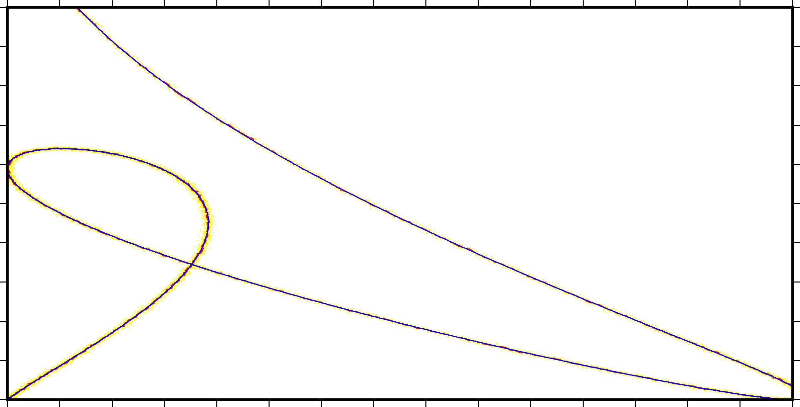

# ExKF

 Ref to [状态转移矩阵计算](https://blog.csdn.net/weixin_41394379/article/details/84581527) and [卡尔曼滤波器、扩展卡尔曼滤波器、无向卡尔曼滤波器的详细推导](https://blog.csdn.net/u013102281/article/details/59109566?utm_medium=distribute.pc_relevant_bbs_down.none-task--2~all~first_rank_v2~rank_v25-2.nonecase&depth_1-utm_source=distribute.pc_relevant_bbs_down.none-task--2~all~first_rank_v2~rank_v25-2.nonecase)

## const vel kf in two dimention
theory:
$$[x_{t+\delta t},y_{t+\delta t},vx_{t+\delta t},vy_{t+\delta t}]^t=[1,0,\delta t,0;0,1,0,\delta t;0,0,1,0;0,0,01][x_t,y_t,vx_t,vy_t]^t$$

measure:
$$[x_m,y_m]^t=[1,0,0,0;0,1,0,0][x_{t+\delta t},y_{t+\delta t},vx_{t+\delta t},vy_{t+\delta t}]^t$$

## test

```cpp
    theory[0]=0.1*i*sin(p[0]/300*3.14159265)+0.1*i;
    theory[1]=0.2*i*sin(p[0]/500*3.14159265)+0.2*i;
    measure[0]=theory[0]+randn(gen)*beta;
    measure[1]=theory[1]+randn(gen)*beta;
```

Figure of result: yellow, measure; red, kalman filter; blue, theory.

## Note on the exKF

* used template with std::valarray and Eigen3.
* self-defined Theory/Measure Function to the predict/update process is enabled with lambda, functor, function, and etc.
* Theory/Measure Function with the follow form:
```cpp
 typedef std::valarray<Diff<Cell>> (*Apply)(const std::valarray<Diff<Cell>>& argsin,const std::valarray<Cell>&parameter);
```
,and it is enable auto-partial process with Diff class defined in File `Diff.hpp` which can be enriched `if` and some other feature to deal with no smooth process.
*  Updating with Measurements is enabled with variantable number and changable Measurements-Equtions in each epoch.

## Contributions

Thanks to `Eigen3` and `GMT` tools for Linear Solver and Plotting.